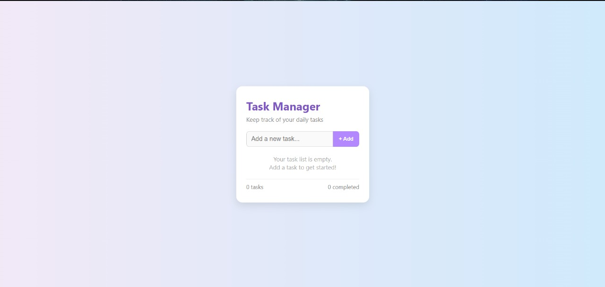

# task-2
Build a To-Do List Web App 

## Description:
Task Manager – To-Do List Web App
This is a front-end **To-Do List Web Application** built using **HTML, CSS, and Vanilla JavaScript** as part of my web development internship (Task 2). The app helps users add, complete, and delete tasks with a smooth and responsive UI.

## Features added

-  Pastel-themed UI with a modern, minimalistic design
-  Add new tasks dynamically
-  Mark tasks as completed (with strike-through)
-  Delete individual tasks
-  Real-time updates (no page reloads)
-  Live counter for total and completed tasks
-  Empty state message when no tasks are present

## Technologies Used

- **HTML5** – structure
- **CSS3** – styling and layout (pastel gradient and card design)
- **Vanilla JavaScript** – interactivity (DOM manipulation & events)

## Files Included
- `index.html`: HTML layout
- `style.css`: CSS with pastel theme and responsive design
- `script.js`: JS for task logic (add, complete, delete)
- `README.md`: Project description

## Screenshot

